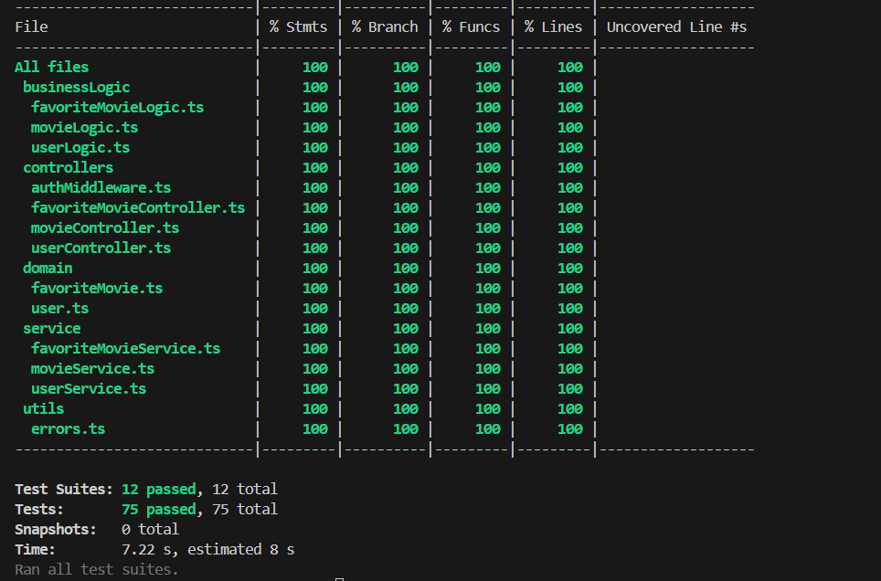

# NodeJs2024 Evaluacion tecnica

## Guia de instalacion
    1.Instalación de Node.js: Asegurase de tener Node.js instalado en el sistema. se puede descargar e instalar desde nodejs.org.

    2. Dado que los paquetes y la configuración de typescript ya se encuentran en el repositorio. Solo falta ejecutar los siguientes comandos por terminal, asegurarse de que la terminal se encuentre en /src 

        npm i
        npx ts-node .\app.ts
    
En caso de que no funcione verificar la configuración en el archivo .env y 
si el problema persiste seguir los siguientes pasos:

    1. Eliminar el package.json, package-lock.json, tsconfig.json, carpeta node_modules y la carpeta coverage (en caso de que esten).

    2.sin sacar la terminal de /src ejecutar los siguientes comandos:
    npm init -y
    npm install --save-dev typescript
    tsc --init
    npm install --save-dev ts-node
    npm install --save-dev @types/node
    npm i
    npx ts-node .\app.ts

## Descripción de la arquitectura

Se cuenta con una arquitectura monolitica sencilla que busca cumplir con todos los requerimientos dados por letra.

### Diagrama de componentes

Para poder cumplir con el requerimiento de "GET movies" se conectó el monolito a través de la librería axios con un proveedor externo por medio de http.

Como se menciono anteriormente se busco priorizar la simplicidad de la aplicación. Separando el codigo para favorecer la modificabilidad. 

| Elemento | Responsabilidad |
|--------- | --------------- |
| src      | Módulo que contiene todos los módulos internos |
| src/routes| Módulo que se encarga de exponer los end points. |
| src/controllers | Módulo que se encarga de llamar a la logica adecuada, y manejar los errores |
| src/businessLogic | Módulo que encarga de agregar la logica en caso de que corresponda y de llamar al servicio adecuado |
| src/service | Módulo que se encarga de guardar y leer de disco |
| src/utils | módulo que contiene parte de la lógica general del sistema | 
| src/domain | módulo que contiene el corportamiento de los objetos del sistema |

A partir de este diagrama podemos ver que se tiene una arquitectura basada en layers (o capas), que nuevamente, se hizo para favorecer la modificabilidad como principal atributo de calidad.

## Cumplimiento de los requerimientos funcionales y opcionales

   >Los endPoints se encuentran adjuntados con casos de prueba en el root del repositorio por medio de una colección de postman.
 

### RF1 + opcional de validación

Para cumplir con el requerimiento de registrar usuarios se creó el endpoint /signup. 
Las validaciones son las siguientes:

email: debe tener por lo menos 8 caracteres y debe contener un @

contraseña: debe tener 8 de largo y contener al menos 1 número y una mayúscula.

nombre y apellido ambos deben ser no vacíos.

Por último, se encripta la contraseña utilizando hashing por medio de la librería bcrypt con una complejidad de 8 (aunque podría cambiarse de ser necesario) priorizando eficiencia por sobre seguridad.

### RF2 + opcional (logout)

Para cumplir el login y logout se crearon 2 endpoints: /signin, /logout

Por medio de la librería jsonWebToken se crean sesiones que son validadas por el sistema. Estas tienen una duración de 2hs en cuyo caso dejan de funcionar, estas son requeridas por los Requerimientos funcionales 3,4,5.
En caso de querer desactivarlas antes. Se creo un nuevo archivo llamado blacklist.txt que bloquea estas sesiones.

### RF3 

Para cumplir con la búsqueda de películas se creó un endpoint: /movies/:keyword? este permite enviar una keyword aunque no es obligatorio.

### RF4 + opcionales

para cumplir con el guardado de películas favoritas se creó un endpoint: /favoritemovies este permite enviar una película extraída del requerimiento funcional 3 y guardarla en disco. Se valida que la película sea la misma que la que provee MovieDB (el titulo y el id coincidan con los guardados en la api).

A su vez estos quedan asociados a un único usuario.

### RF5 + opcionales

Para cumplir con el pedido de películas favoritas se creó un endopoint /favoritemovies este trae todas las películas que le pertenecen al usuario y no le permite ver la de los demás.

### Testeabilidad 
Se decidió testear todo el proyecto por medio de pruebas unitarias y mocks utilizando la librería Jest. Los test pueden ser replicados usando el comando npx jest en /src

## Aclaraciones de letra e implementación

Para el requerimiento 3 (traer películas), el endpoint provisto por movieDB no permite buscar por nombre de keyword, sino que, por id de la misma. Primero se busca el id de la keyword y con esta se busca la/s películas, por ende. 

    1. Solo aparecerán aquellas películas que tengan exactamente ese keyword.
    2. La keyword debe estar bien escrita y completa. 

Para el requerimiento 4 (guardado de películas favoritas) se debe guardar los atributos "id" y "title" que son los que funcionan mejor, debido a que se valida con la base de datos de moviesDB usar "original_title" o similares puede llevar a un 404.

Se comprende que los secrets no deben ser públicos en un repositorio por temas de seguridad. Dado que no se tiene una vault o similar y se busca que cualquier pueda probar la aplicación, el archivo .env se subirá junto con el resto de código.

